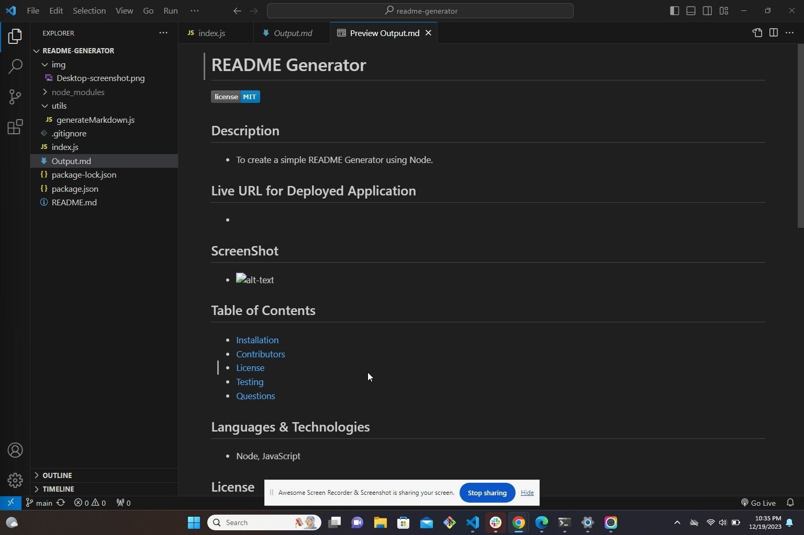
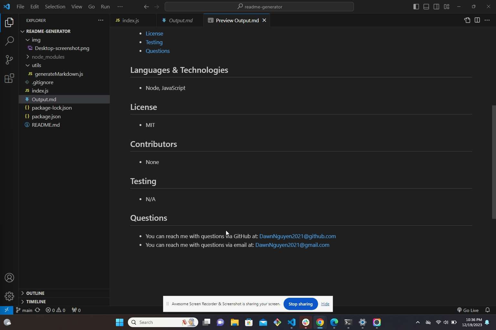

# readme-generator

## Description
This is a simple README generator that creates a professional README through the command line application. I used Node and JavaScript to create this application. 

## Screen Shot

## Link to video
https://www.awesomescreenshot.com/video/23434169?key=e5eec9c7a098e7f0f14689d70264d8ea
