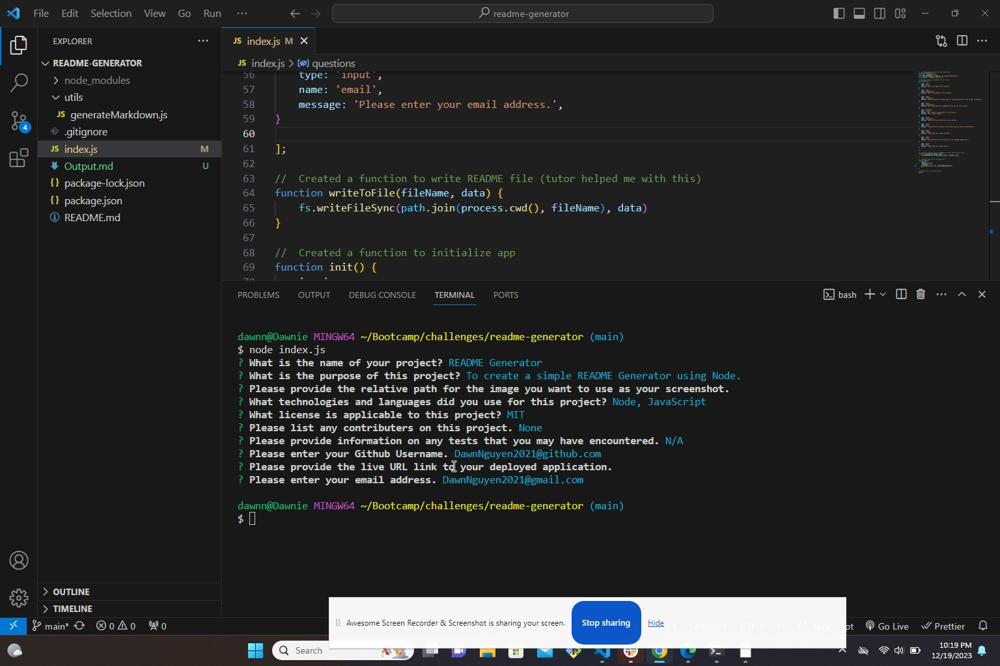

# readme-generator

## Description
This is a simple README generator that creates a professional README through the command line application. I used Node and JavaScript to create this application. 

## Screen Shot
